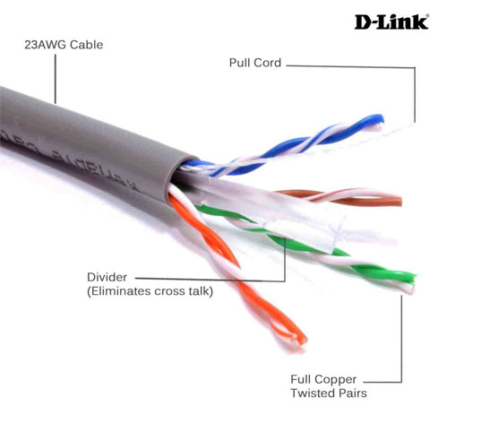
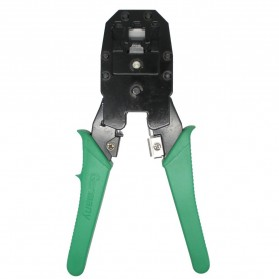
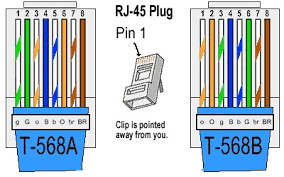
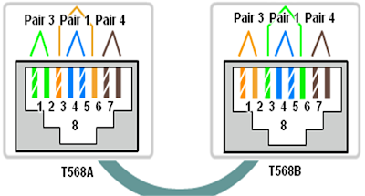

# Crimping dan Wireshark

## Daftar Isi
+ 1.[Wire Crimping](#wire-crimping)
     + 1.1 [Peralatan yang dibutuhkan](#peralatan-yang-dibutuhkan)
     + 1.2 [Jenis-jenis Konfigurasi Kabel UTP]()
     + 1.3 [Langkah-langkah](#langkah-langkah)
+ 2.[Wireshark](#wireshark)

## 1. Wire Crimping
Dalam jaringan komputer, terjadi komunikasi antara satu perangkat dengan perangkat lainnya. Komunikasi itu tentu membutuhkan suatu media. Walaupun sudah ada teknologi komunikasi nirkabel, peran kabel dalam jaringan masih penting dan belum tergantikan. Oleh karena itu dalam modul kali ini, kita akan belajar cara melakukan _crimping_ pada salah satu jenis kabel jaringan yang bernama kabel UTP (_Unshielded Twisted Pair_).

### 1.1 Peralatan yang dibutuhkan
Untuk melakukan _wire crimping_ kita membutuhkan peralatan di bawah ini:
#### a. Kabel UTP

Bahan utama dari proses ini.
#### b. RJ45

RJ45 adalah konektor yang akan menghubungkan kabel UTP dengan perangkat.
#### c. Tang Crimping

Tang ini digunakan untuk memasangkan kabel pada RJ45.
#### d. LAN Tester

Seperti namanya, alat ini digunakan untuk memeriksa apakah kabel yang kita buat berfungsi dengan baik atau tidak.
### 1.2 Konfigurasi Kabel
Ada beberapa macam konfigurasi kabel. Dari urutan warnanya yang sesuai standar internasional dapat dibagi menjadi __T568A__ dan __T568B__.

Sedangkan dari pemasangannya dibagi menjadi
#### b. __Kabel Straight-Through__
  Jenis pengkabelan ini digunakan untuk menyambungkan dua perangkat yang berbeda. misalnya antara router dengan switch/hub, komputer ke switch dan komputer ke hub.
  

  
  Aturan pemasangannya adalah bahwa tiap ujung kabel harus memiliki urutan warna yang sama. Misal ujung yang satu menggunakan susunan warna berdasarkan aturan T568A maka begitu juga ujung lainnya.

#### b. __Kabel Crossover__
Berkebalikan dengan kabel Straight-through, pengkabelan ini digunakan untuk menyambungkan dua perangkat yang sama. Misalnya antara komputer dengan komputer, router dengan router, switch dengan switch, hub dengan hub.
  
  
  
  Aturan pemasangannya pun berbeda dengan kabel jenis straight-trough, kabel jenis Crossover memiliki urutan warna yang berbeda dikedua ujungnya. Tapi, perbedaan warna ini tidak boleh sembarangan, karena kedua ujung ini juga memiliki aturan urutan warna. Pada kabel jenis Crossover standar, jika salah satu ujung Pin memiliki susunan warna berdasarkan aturan T568A, maka ujung Pin yang lain harus memiliki urutan warna berdasarkan standar T568B.

### 1.3 Langkah - Langkah
1. Siapkan keperluan crimping (kabel UTP, RJ45, tang crimping, LAN tester)
2. Kupas pelindung kabel UTP
3. Urutkan kabel sesuai konfigurasi yang diinginkan (Straight/Cross/yang lainnya).
4. Potong ujung kabel untuk meratakannya.
5. Masukkan ujung kabel tersebut ke RJ45 dan pastikan menyentuh ujung RJ45.
6. Gunakan tang crimping untuk mengunci kabel UTP dalam RJ45 (pastikan ujung kabel masih menempel dengan ujung RJ45 saat penguncian dilakukan)
7. Terakhir, gunakan LAN tester untuk memastikan kabel yang anda buat bekerja dengan baik.

## 2. Wireshark
Wireshark adalah sebuah aplikasi penganalisa paket jaringan. Penganalisa paket jaringan akan mencoba menangkap paket jaringan dan mencoba untuk menampilkan data paket sedetail mungkin. 
Sebuah jaringan komputer dibangun dengan tujuan mengirimkan atau menerima data antara satu end-point dengan end-point lainnya. Data dikirim dalam bentuk paket-paket. Struktur sebuah paket terdiri dari :

***1. Header***
Bagian header berisi alamat dan data lainnya yang dibawa oleh paket. Struktur dari header meliputi :
| Intruksi | Keterangan |
| --- | --- |
| Panjang paket | Beberapa jaringan sudah memiliki panjang paket yang baku (*fixed-lenght*), sementara yang lain bergantung pada header untuk memuat informasi ini |
| Sinkronisasi | Beberapa bit yang membantu paket mencocokkan jaringan yang dimaksud |
| Nomor paket | Menunjukkan urutan dari total paket yang ada |
| Protokol | Pada jaringan yang membawa lebih dari satu macam informasi, protokol ini menunjukkan jenis paket yang ditransmiskan: e-mail, halaman web, atau yang lain |
| Alamat tujuan | Ke mana paket dikirimkan |
| Alamat asal | Dari mana paket dikirimkan |

***2. Payload***
Payload juga disebut sebagai ***body*** dari paket. Pada bagian inilah data yang akan dikirimkan lewat paket berada

***3. Trailer***
trailer, kadang-kadang disebut ***footer***, biasanya memuat sepasang bit yang memberi sinyal pada perangkat penerima bahwa paket sudah mencapai ujungnya. trailer juga bisa memuat semacam *error checking*.

### 2.1 Instalasi
Instalasi untuk OS WIndows atau macOS bisa mengunduh installer pada [ laman ini](https://www.wireshark.org/download.html). Untuk OS linux dapat melihat tutorialnya [di sini]([https://linuxtechlab.com/install-wireshark-linux-centosubuntu/](https://linuxtechlab.com/install-wireshark-linux-centosubuntu/)).
Setelah melakukan instalasi , jalankan Wireshark sebagai **administrator** (WIndows) atau **root** (linux)
Berikut tampilan awalnya :

### 2.2 Filters
Dalam Wireshark terdapat 2 jenis filter yaitu ***Capture Filter*** dan ***Display Filter***

#### 2.2.1 Capture Filter
[Gambar]()

 - Definisi : Memilah paket yang akan ditangkap (captured). Paket yang tidak memenuhi kriteria dibiarkan lewat tanpa ditangkap
 - Sintaks filter dapat terdiri dari 1 atau lebih **primitive**. primitive sendiri biasanya terdiri dari sebuah **id** (bilangan atau nama) yang didahului oleh 1 atau lebih jenis qualifier. Perlu diingat bahwa dalam 1 primitive tidak boleh ada 2 atau lebih qualifier sejenis
 - Jenis qualifier :

| Qualifier | Keterangan | Contoh |
|--|--|--|
| type | Menentukan jenis id atau nama yang menjadi nilai filter | host, net, port, portrange |
| dir | Menentukan direction atau arah dari id | src, dst, dan lain-lain |
| proto | Menentukan protokol dari id | tcp, udp, dan lain-lain |

 - Sintaks filter dapat memuat operator, tanda kurung, negasi ( `!` / `not` ), dan kongjungsi ( `&&` / `and` atau `||` / `or` ). Kongjungsi digunakan untuk menghubungkan 2 primitive dalam satu sintaks
 - Contoh sintaks capture filter :

| Filter expression / Primitive(s) | Keterangan |
|--|--|
| `host 10.151.36.1` | Menangkap semua paket yang spesifik menuju ke atau berasal dari alamat 10.151.36.1 |
| `src host 10.151.36.1` | Menangkap semua paket spesifik menuju ke atau berasal dari alamat 10.151.36.1 |
| `net 192.168.0.0/24` atatu `net 192.168.0.0 mask 255.255.255.0` | Menangkap semua paket yang berasal dari atau menuju ke subnet 192.168.0.0/24 |
| `dst net 192.168.0.0/24` | Menangkap semua paket yang menuju ke subnet 192.168.0.0/24 |
| `udp port 80` | Menangkap semua paket dengan protokol UDP yang menuju ke atau berasal dari port 80 |
| `tcp src port 22 || host 10.151.36.30` | Menangkap semua paket dengan protokol TCP yang berasal dari port 22 atau semua paket yang berasal dari atau menuju ke alamat 10.151.36.30 |

 - Contoh capture filter `tcp dst port 443`
[Gambar]()

#### 2.2.2 Display Filter

 - Definisi : Memilah paket yang akan ditampilkan dari kumpulan paket yang sudah ditangkap
 - Secara umum sintaks display filter terdiri dari `[protokol] [field] [comparison operator] [value]`. Berikut ini daftar ***comparison operator*** yang tersedia : 

| English | Comparison Operator (C-like) | Indonesia |
|---|---|---|
| equal | == | Sama dengan |
| inequality | != | Tidak sama dengan |
| greater than | > | Lebih besar dari |
| less than | < | Lebih kecil dari |
| greater than or equal than | >= | Lebih besar dari atau sama dengan |
| less than or equal to | <= | Lebih kecil dari atau sama dengan |
| contains |  | Protokol atau field mengandung nilai tertentu |
| matches | ~ | Protokol atau field cocok dengan *regular expression* |
| bitwise_and | & | Membandingkan nilai bit sebuah field |

 - Pada display filter bisa menggabungkan 2 filter expression dengan ***logical operator***

| Logical Operator | Keterangan |
|---|---|
| `and` atau `&&` | logical AND |
| `or` atau `||` | logical OR |
| `xor` atau `^^` | logical XOR |
| `not` atau `!` | logical NOT |
| `[...]` | substring operator |
| `in` | membership operator |

 - Contoh penggunaan display filter :

| Filter expression | Keterangan |
|---|---|
| `tcp.port == 443` | Menampilkan semua paket dengan protokol TCP yang menuju ke atau berasal dari port 443 |
| `ip.src == 192.168.0.1 || ip.dst == 192.168.0.1` | Menampilkan semua paket yang berasal dari alamat 192.168.0.1 atau menuju ke alamat 192.168.0.1 |
| `http.request.uri constains "login"` | Menampilkan semua paket dengan protokol HTTP yang URI nya mengandung string "login" |

 - Contoh 

## Referensi
+ https://nyengnyeng.com/macam-macam-kabel-jaringan-komputer/
+ http://haidirhmc.blogspot.com/2011/12/urutan-warna-kabel-lan-atau-kabel-t568a.html
+ https://www.nesabamedia.com/pengertian-dan-fungsi-kabel-utp/
+ https://www.berguruit.com/2017/09/cara-crimping-kabel-lan-rj45-yang-baik.html
+ https://www.wireshark.org/docs/wsug_html_chunked/ChapterIntroduction.html]

<!--stackedit_data:
eyJoaXN0b3J5IjpbMjQ4MDg3MTAwLC00MzkzMzc2NiwtMTgwOD
IxMzQ5NCwtMjA1MjM2MTMzMiwtMTMwNDU4NzU4OCwtMTQ5ODQ5
ODc5OCw3NTY2NjM5ODEsLTgxNjYxMDk4NywtNzA1Mjg1NTA2LD
IwOTg1OTUwNDQsODgxMDgzMTgsLTE5NjIyODI4MzgsMjA5MDU2
ODc5NywtMTMxNTc4NDMyNCwtMjEwOTYyMjQ0MiwtNzg1MDE2Nz
g0LDcxMDMyMTAzMCw5MTU1OTUzMTQsMTIyOTc4MTExNywtMTQ0
ODgyNzI0OV19
-->