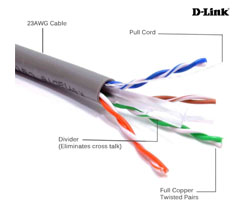

# Crimping dan Wireshark

## Daftar Isi
+ 1.[Wire Crimping](#wire-crimping)
     + 1.1 [Peralatan yang dibutuhkan](#peralatan-yang-dibutuhkan)
     + 1.2 [Jenis-jenis Konfigurasi Kabel UTP]()
     + 1.3 [Langkah-langkah](#langkah-langkah)
+ 2.[Wireshark](#wireshark)

## 1. Wire Crimping
Dalam jaringan komputer, terjadi komunikasi antara satu perangkat dengan perangkat lainnya. Komunikasi itu tentu membutuhkan suatu media. Walaupun sudah ada teknologi komunikasi nirkabel, peran kabel dalam jaringan masih penting dan belum tergantikan. Oleh karena itu dalam modul kali ini, kita akan belajar cara melakukan _crimping_ pada salah satu jenis kabel jaringan yang bernama kabel UTP (_Unshielded Twisted Pair_).

### 1.1 Peralatan yang dibutuhkan
Untuk melakukan _wire crimping_ kita membutuhkan peralatan di bawah ini:
#### a. Kabel UTP

Bahan utama dari proses ini.
#### b. RJ45

RJ45 adalah konektor yang akan menghubungkan kabel UTP dengan perangkat.
#### c. Tang Crimping

Tang ini digunakan untuk memasangkan kabel pada RJ45.
#### d. LAN Tester

Seperti namanya, alat ini digunakan untuk memeriksa apakah kabel yang kita buat berfungsi dengan baik atau tidak.
### 1.2 Langkah - Langkah
1. Siapkan keperluan crimping (kabel UTP, RJ45, tang crimping, LAN tester)
2. Kupas pelindung kabel UTP
3. Urutkan kabel sesuai konfigurasi yang diinginkan (Straight/Cross/yang lainnya).
4. Potong ujung kabel untuk meratakannya.
5. 

### 2. Wireshark
Sebuah aplikasi penganalisa paket jaringan. Penganalisa paket jaringan akan mencoba menangkap paket jaringan dan mencoba untuk menampilkan data paket sedetail mungkin. Struktur sebuah paket terdiri dari :
### 2.1 Instalasi

### 2.2 Filters

#### 2.2.1 Capture Filter

#### 2.2.2 Display Filter1.2 Langkah - 

## Referensi
+ https://nyengnyeng.com/macam-macam-kabel-jaringan-komputer/
+ http://mediatech.co.id/mediatech-catalog/networking/item/root/rj-45.html
+ https://www.wireshark.org/docs/wsug_html_chunked/ChapterIntroduction.html]

<!--stackedit_data:
eyJoaXN0b3J5IjpbMTkyOTgzMDIyOCwxMjI5NzgxMTE3LC0xND
Q4ODI3MjQ5LC01Njg4ODg5NjQsLTE4NjY0MTc3MzAsLTc4ODg3
MDYyMiwtNDAyODExNzM0LDEwODU5OTU4NjIsMTAzOTkxODUyXX
0=
-->