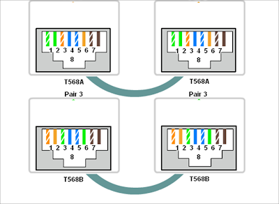

# Crimping dan Wireshark

## Daftar Isi
+ 1.[Wire Crimping](#wire-crimping)
     + 1.1 [Peralatan yang dibutuhkan](#peralatan-yang-dibutuhkan)
     + 1.2 [Jenis-jenis Konfigurasi Kabel UTP]()
     + 1.3 [Langkah-langkah](#langkah-langkah)
+ 2.[Wireshark](#wireshark)

## 1. Wire Crimping
Dalam jaringan komputer, terjadi komunikasi antara satu perangkat dengan perangkat lainnya. Komunikasi itu tentu membutuhkan suatu media. Walaupun sudah ada teknologi komunikasi nirkabel, peran kabel dalam jaringan masih penting dan belum tergantikan. Oleh karena itu dalam modul kali ini, kita akan belajar cara melakukan _crimping_ pada salah satu jenis kabel jaringan yang bernama kabel UTP (_Unshielded Twisted Pair_).

### 1.1 Peralatan yang dibutuhkan
Untuk melakukan _wire crimping_ kita membutuhkan peralatan di bawah ini:
#### a. Kabel UTP

Bahan utama dari proses ini.
#### b. RJ45

RJ45 adalah konektor yang akan menghubungkan kabel UTP dengan perangkat.
#### c. Tang Crimping

Tang ini digunakan untuk memasangkan kabel pada RJ45.
#### d. LAN Tester

Seperti namanya, alat ini digunakan untuk memeriksa apakah kabel yang kita buat berfungsi dengan baik atau tidak.
### 1.2 Konfigurasi Kabel
Ada beberapa macam konfigurasi kabel. Dari urutan warnanya yang sesuai standar internasional dapat dibagi menjadi __T568A__ dan __T568B__.

Sedangkan dari pemasangannya dibagi menjadi
#### b. __Kabel Straight-Through__
  Jenis pengkabelan ini digunakan untuk menyambungkan dua perangkat yang berbeda. misalnya antara router dengan switch/hub, komputer ke switch dan komputer ke hub.
  

  
  Aturan pemasangannya adalah bahwa tiap ujung kabel harus memiliki urutan warna yang sama. Misal ujung yang satu menggunakan susunan warna berdasarkan aturan T568A maka begitu juga ujung lainnya.

#### b. __Kabel Crossover__
Berkebalikan dengan kabel Straight-through, pengkabelan ini digunakan untuk menyambungkan dua perangkat yang sama. Misalnya antara komputer dengan komputer, router dengan router, switch dengan switch, hub dengan hub.
  
  
  
  Aturan pemasangannya pun berbeda dengan kabel jenis straight-trough, kabel jenis Crossover memiliki urutan warna yang berbeda dikedua ujungnya. Tapi, perbedaan warna ini tidak boleh sembarangan, karena kedua ujung ini juga memiliki aturan urutan warna. Pada kabel jenis Crossover standar, jika salah satu ujung Pin memiliki susunan warna berdasarkan aturan T568A, maka ujung Pin yang lain harus memiliki urutan warna berdasarkan standar T568B.

### 1.3 Langkah - Langkah
1. Siapkan keperluan crimping (kabel UTP, RJ45, tang crimping, LAN tester)
2. Kupas pelindung kabel UTP
3. Urutkan kabel sesuai konfigurasi yang diinginkan (Straight/Cross/yang lainnya).
4. Potong ujung kabel untuk meratakannya.
5. Masukkan ujung kabel tersebut ke RJ45 dan pastikan menyentuh ujung RJ45.
6. Gunakan tang crimping untuk mengunci kabel UTP dalam RJ45 (pastikan ujung kabel masih menempel dengan ujung RJ45 saat penguncian dilakukan)
7. Terakhir, gunakan LAN tester untuk memastikan kabel yang anda buat bekerja dengan baik.

## 2. Wireshark
Wireshark adalah sebuah aplikasi penganalisa paket jaringan. Penganalisa paket jaringan akan mencoba menangkap paket jaringan dan mencoba untuk menampilkan data paket sedetail mungkin. 
Sebuah jaringan komputer dibangun dengan tujuan mengirimkan atau menerima data antara satu end-point dengan end-point lainnya. Data dikirim dalam bentuk paket-paket. Struktur sebuah paket terdiri dari :

***1. Header***
| Intruksi | Keterangan |
| --- |--- |
| Panjang paket |  |
|

### 2.1 Instalasi

### 2.2 Filters

#### 2.2.1 Capture Filter

#### 2.2.2 Display Filter1.2 Langkah - 

## Referensi
+ https://nyengnyeng.com/macam-macam-kabel-jaringan-komputer/
+ http://haidirhmc.blogspot.com/2011/12/urutan-warna-kabel-lan-atau-kabel-t568a.html
+ https://www.nesabamedia.com/pengertian-dan-fungsi-kabel-utp/
+ https://www.berguruit.com/2017/09/cara-crimping-kabel-lan-rj45-yang-baik.html
+ https://www.wireshark.org/docs/wsug_html_chunked/ChapterIntroduction.html]

<!--stackedit_data:
eyJoaXN0b3J5IjpbNjI3OTM3NjYxLC04MTY2MTA5ODcsLTcwNT
I4NTUwNiwyMDk4NTk1MDQ0LDg4MTA4MzE4LC0xOTYyMjgyODM4
LDIwOTA1Njg3OTcsLTEzMTU3ODQzMjQsLTIxMDk2MjI0NDIsLT
c4NTAxNjc4NCw3MTAzMjEwMzAsOTE1NTk1MzE0LDEyMjk3ODEx
MTcsLTE0NDg4MjcyNDksLTU2ODg4ODk2NCwtMTg2NjQxNzczMC
wtNzg4ODcwNjIyLC00MDI4MTE3MzQsMTA4NTk5NTg2MiwxMDM5
OTE4NTJdfQ==
-->